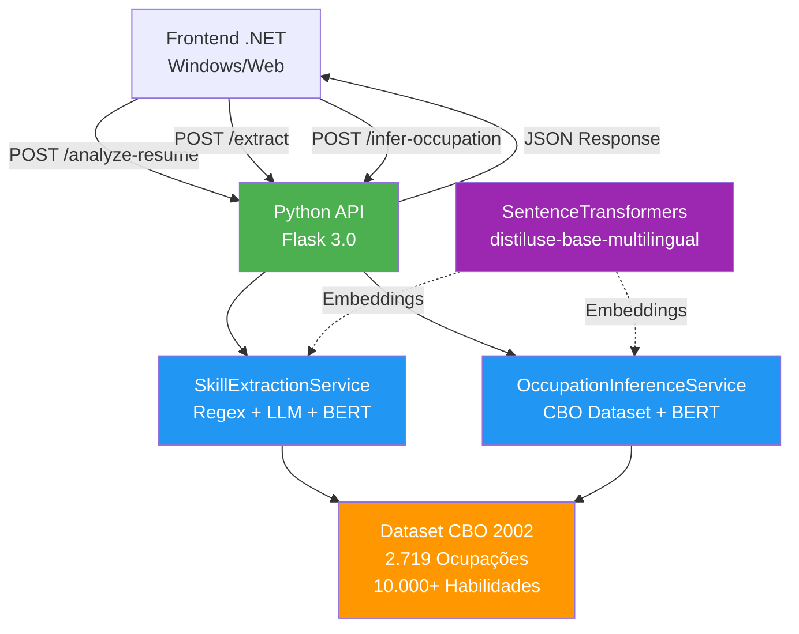
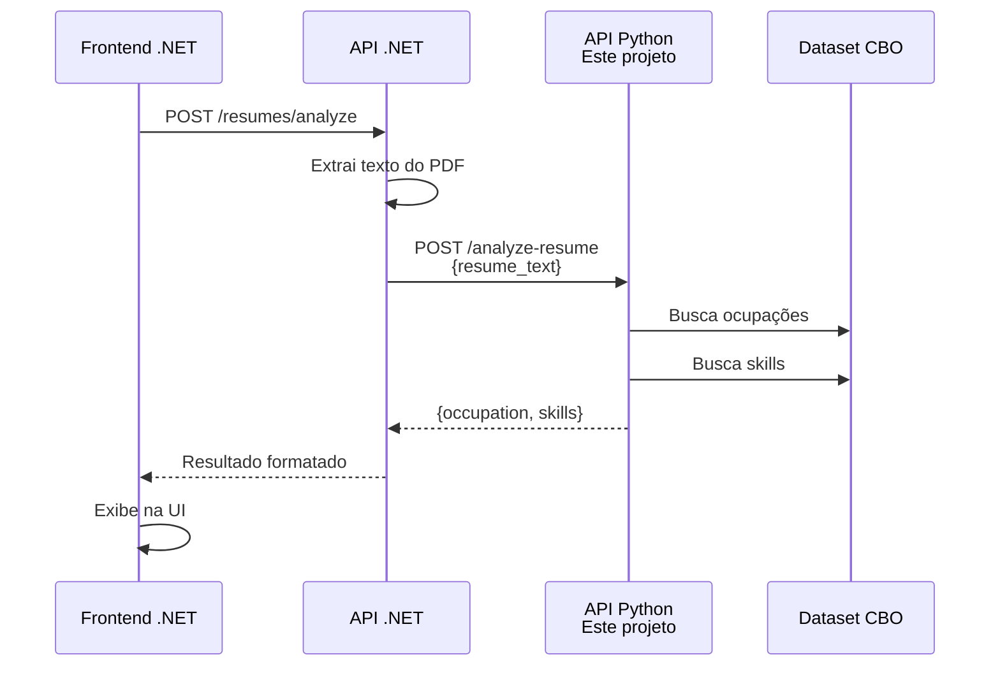

# 🤖 Sistema de IA para Análise de Currículos - Python API

> **Projeto:** Global Solution FIAP 2025  
> **Instituição:** FIAP - Faculdade de Informática e Administração Paulista  
> **Curso:** Análise e Desenvolvimento de Sistemas

---

## 👥 Equipe Responsável

| RM | Nome |
|---|---|
| RM556152 | Daniel da Silva Barros |
| RM558253 | Luccas de Alencar Rufino |
| RM5550063 | Raul Clauson |

---

## 📋 Descrição do Projeto

Esta API Python realiza **análise inteligente de currículos** usando **IA e BERT semântico**, fornecendo:

- 🎯 **Inferência de Ocupação**: Identifica a profissão do candidato automaticamente
- 💼 **Extração de Skills**: Detecta habilidades técnicas com precisão (apenas para profissões técnicas)
- 📊 **Análise de Compatibilidade**: Calcula o match entre skills do candidato e requisitos da vaga
- 🧠 **Inteligência Semântica**: Usa modelos BERT multilíngues para matching preciso

---

## 🏗️ Arquitetura do Sistema



---

## 🚀 Começando

### 1️⃣ **Pré-requisitos**

Instale:
- **Python 3.9+**
- **pip** (gerenciador de pacotes)
- **Git**

### 2️⃣ **Instalação**

```bash
# 1. Clone o repositório
cd c:/Users/seu_usuario/Desktop/entregas-gs/ia-gs2-2025/api

# 2. Crie um ambiente virtual
chmod +x *.sh
./install.sh
```

### 3️⃣ **Iniciar o Servidor**

```bash
# Com FLASK_ENV em produção (sem debug)
set FLASK_ENV=production
python run.py
```

**Esperado:**
```
2025-11-20 18:00:00 - app - INFO - Aplicação Flask criada com sucesso
* Running on http://127.0.0.1:5001
* Debugger PIN: 123-456-789
```

⏳ **Aguarde 45-50 segundos** para o modelo BERT carregar na memória.

---

## 📡 Endpoints da API

### 1. Analisar Currículo Completo (Recomendado)
**Endpoint mais importante** - Faz tudo em uma requisição!

```http
POST http://127.0.0.1:5001/api/v1/analyze-resume
Content-Type: application/json

{
  "resume_text": "Sou desenvolvedor Python com 5 anos de experiência...",
  "threshold_occupation": 0.65,
  "threshold_skills": 0.75,
  "top_k_occupations": 3
}
```

**Resposta (Desenvolvedor):**
```json
{
  "status": "success",
  "resume_type": "technical",
  "primary_occupation": {
    "titulo": "Desenvolvedor Python",
    "codigo": "317105",
    "score": 0.92,
    "confidence": "high"
  },
  "skills": [
    {
      "original": "Python",
      "matched_skill": "programação python",
      "similarity_score": 0.95,
      "confidence": "high"
    }
  ],
  "total_skills_found": 12,
  "successful_matches": 10,
  "processing_time": 2.345
}
```

**Resposta (Médico):**
```json
{
  "status": "success",
  "resume_type": "non_technical",
  "primary_occupation": {
    "titulo": "Cardiologista",
    "codigo": "225101",
    "score": 0.92,
    "confidence": "high"
  },
  "skills": [],
  "note": "Currículo de profissão não-técnica. Skills não foram extraídas.",
  "processing_time": 1.234
}
```

---

### 2. Extrair Skills (Apenas)

```http
POST http://127.0.0.1:5001/api/v1/extract
Content-Type: application/json

{
  "resume_text": "Possuo experiência com Python, Docker e AWS...",
  "threshold": 0.75,
  "top_k": 1
}
```

**Resposta:**
```json
{
  "status": "success",
  "processing_time": 1.234,
  "total_skills_found": 8,
  "successful_matches": 7,
  "match_rate": "87.5%",
  "skills": [
    {
      "original": "Python",
      "matched_skill": "programação python",
      "similarity_score": 0.95,
      "confidence": "high"
    }
  ]
}
```

---

### 3. Inferir Ocupação (Apenas)

```http
POST http://127.0.0.1:5001/api/v1/infer-primary-occupation
Content-Type: application/json

{
  "resume_text": "Trabalho como desenvolvedor full-stack há 3 anos...",
  "threshold": 0.65
}
```

**Resposta:**
```json
{
  "status": "success",
  "processing_time": 0.567,
  "primary_occupation": {
    "titulo": "Desenvolvedor Full Stack",
    "codigo": "317115",
    "score": 0.88,
    "confidence": "high"
  }
}
```

---

### 4. Health Check

```http
GET http://127.0.0.1:5001/api/v1/health/
```

**Resposta:**
```json
{
  "status": "healthy",
  "services": {
    "extraction": "ready",
    "occupation": "ready"
  },
  "model_ready": true,
  "timestamp": 1700505000.123
}
```

---

## 🔗 Integrando com .NET (Frontend)

### Fluxo: .NET → Python → Resultado



### Como chamar da .NET:

A .NET API já está configurada para chamar esta API Python! Exemplos:

```csharp
// No ResumeService.cs
var response = await _resumeService.AnalyzeResumeAsync(
    resumeText: "Texto do currículo...",
    thresholdOccupation: 0.65f,
    thresholdSkills: 0.75f
);

// Resultado:
// response.ResumeType = "technical" ou "non_technical"
// response.PrimaryOccupation.Titulo = "Cardiologista"
// response.Skills = [...]
```

---

## 🛠️ Tecnologias Utilizadas

| Tecnologia | Versão | Uso |
|---|---|---|
| **Flask** | 3.0.0 | Framework Web |
| **Sentence Transformers** | Latest | Embeddings BERT |
| **PyTorch** | Latest | Processamento de IA |
| **Pandas** | Latest | Processamento de dados |
| **Regex** | Built-in | Extração padrões |

### Dataset

- **CBO 2002** (2.719 ocupações)
- **7.833 sinônimos** de profissões
- **10.000+ habilidades** indexadas
- **Modelos multilíngues** (português, inglês, etc)

---

## ⚙️ Configuração (Variáveis de Ambiente)

Crie arquivo `.env` na pasta `api/`:

```env
FLASK_ENV=development
FLASK_DEBUG=True

API_PORT=5001
API_HOST=0.0.0.0
API_WORKERS=4

MODEL_NAME=sentence-transformers/distiluse-base-multilingual-cased-v2
MIN_SIMILARITY_THRESHOLD=0.60
CACHE_MODEL=True

DATASET_PATH=../dataset

LOG_LEVEL=INFO
LOG_FILE=logs/api.log

PYTHON_API_URL=http://localhost:5001

PYTHON_API_TIMEOUT=30
```

---

## 📊 Performance

| Operação | Tempo (primeira) | Tempo (cache) |
|---|---|---|
| Carregar BERT | 45-50s | - |
| Analisar currículo | 2-3s | 0.8-1.2s |
| Extrair skills | 1-2s | 0.5-0.8s |
| Inferir ocupação | 1.5-2s | 0.6-0.9s |

---

## 🐛 Troubleshooting

### Erro: "Impossível conectar"
```
Solução: Aguarde 50 segundos para BERT carregar. Verifique porta 5001.
```

### Erro: "Model not loaded"
```
Solução: Reinicie o servidor. Aguarde os logs de inicialização.
```

### Erro: "NoneType has no attribute 'strip'"
```
Solução: Envie resume_text válido e não vazio (mín. 10 caracteres).
```

---

## 📝 Estrutura de Arquivos

```
ia-gs2-2025/api/
├── app/
│   ├── __init__.py              # Criar app Flask
│   ├── routes/
│   │   ├── extraction.py        # Endpoints (analyze, extract, infer)
│   │   ├── skills.py           # Endpoints antigos (legados)
│   │   └── health.py           # Health checks
│   ├── services/
│   │   ├── extraction_service.py         # Extração de skills
│   │   ├── occupation_inference_service.py # Inferência de ocupação
│   │   └── skills_service.py   # Serviço de skills
│   ├── models/
│   │   ├── cbo_loader.py       # Carregador CBO dataset
│   │   └── skills_matcher.py   # Matching BERT
│   └── utils/
│       └── logger.py           # Configuração de logs
├── dataset/
│   ├── CBO2002 - Ocupacao.csv
│   ├── CBO2002 - Sinonimo.csv
│   └── ... (outros CSVs)
├── run.py                        # Entry point
└── requirements.txt              # Dependências
```

---

## 🧪 Testando Localmente

### Com cURL:

```bash
curl -X POST http://127.0.0.1:5001/api/v1/analyze-resume \
  -H "Content-Type: application/json" \
  -d '{
    "resume_text": "Sou desenvolvedor Python com 5 anos de experiência em Django e AWS...",
    "threshold_occupation": 0.65,
    "threshold_skills": 0.75
  }'
```

### Com Postman:

1. Abra Postman
2. Nova requisição → POST
3. URL: `http://127.0.0.1:5001/api/v1/analyze-resume`
4. Body → Raw → JSON
5. Cole o JSON acima
6. Send

---

## 📚 Documentação Adicional

- **CBO 2002**: [Classificação Brasileira de Ocupações](http://www.mtecbo.gov.br/)
- **Sentence Transformers**: [Documentação](https://www.sbert.net/)
- **Flask**: [Documentação Oficial](https://flask.palletsprojects.com/)

---

## ✅ Checklist de Deployment

- [ ] Python 3.9+ instalado
- [ ] Virtual env criado e ativado
- [ ] `pip install -r requirements.txt` executado
- [ ] FLASK_ENV configurado como "production"
- [ ] Porta 5001 disponível
- [ ] Servidor Python rodando: `python run.py`
- [ ] Aguardado 50s para BERT carregar
- [ ] Health check respondendo 200 OK
- [ ] .NET API conectada (http://localhost:5001)

---

## 🤝 Suporte

Dúvidas? Verifique:
1. Logs no console (informações detalhadas)
2. Health check (`/api/v1/health/`)
3. Configuração de variáveis de ambiente

---